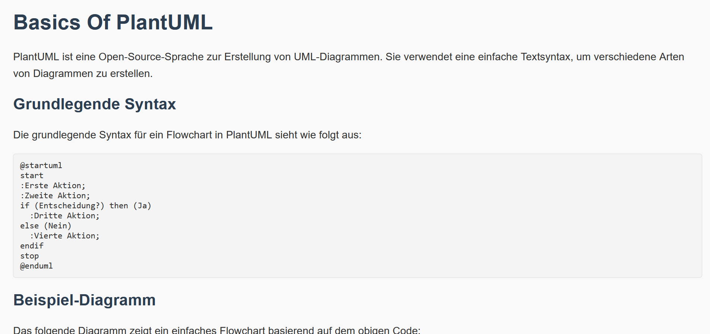

# Learning Website: Basics of PlantUML

This repository contains a webpage that explains the basics of PlantUML.

## Preview

## Features

- Introduction to PlantUML
- Basic syntax and examples
- Visual representation of UML diagrams
